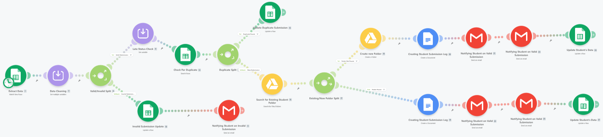

# Automated Student Assignment Processing System

An enterprise-grade, event-driven automation workflow that streamlines academic assignment submissions. Built using **Make.com**, **Google Workspace (Forms, Sheets, Docs, Drive)**, and **Gmail**, this system eliminates manual administrative overhead by automatically validating, cleaning, sorting, and indexing student work while keeping both students and instructors continuously synchronized.

---

## 🛠️ The Core Problems This System Solves

Manual assignment management introduces significant administrative friction, human error, and processing delays. This project solves several critical operational bottlenecks:

1. **Messy & Unstandardized Inputs:** Students frequently submit data with inconsistent casing (e.g., `sadia aktar` instead of `Sadia Aktar`), shorthand terms (e.g., `ui ux` instead of `UI/UX Design`), and domain typos (e.g., `@GAMIL.COM` instead of `@gmail.com`). The automation standardizes names, courses, and emails programmatically before any records are saved.
2. **File & Folder Organization Chaos:** Instructors typically waste hours creating individual student folders, naming them, and moving files manually. This system builds a dynamic, cleanly structured hierarchy inside Google Drive on the fly.
3. **Data Duplication:** Students often resubmit assignments out of panic or to fix small mistakes, which creates duplicate records and clutters folders. This architecture implements backend database checking to trap and segment duplicate runs automatically based on bundle counts.
4. **Invalid Submissions & Broken Links:** Submitting a plain text note (like `empty`) instead of a valid assignment URL, or providing a structurally invalid email, typically breaks simple workflows. This architecture catches syntax issues early and routes them to a dedicated correction loop.
5. **Communication Gaps:** Students wonder if their work went through, and instructors don't have immediate access links to grade. This workflow handles two-way instant HTML email notifications with embedded direct-access folder and document tokens.

---

## 🏗️ System Architecture & Workflow Process

The automation is structured as a programmatic pipeline consisting of strict validation, data cleaning, state handling, deduplication, file generation, and communication layers:

1. **Trigger Phase:** The workflow initializes when a new form response row is appended to the master Google Sheet database.
2. **Data Transformation Phase:** Inputs pass through a text-cleaning layer (`Tools 7`) where string manipulation formulas capitalize names, fix structural email typos, and translate variations of course names into standardized labels.
3. **Validation Filter Phase:** A routing mechanism evaluates the submission link format and the email structure. Clean submissions pass to the core processing engine, while invalid configurations are rejected and assigned an error status.
4. **Database Deduplication Phase:** A search operation sweeps the database using the normalized values. If it detects that this email and assignment week combo has already been processed, it marks the entry as a duplicate and halts execution to safeguard storage structures.
5. **Directory & Asset Generation Phase:** The system dynamically checks if a permanent directory exists for the student. If not, it builds a personalized folder. A new Google Doc assignment record is generated inside that folder using an official formatting template.
6. **Data Synchronicity & Communication Phase:** The student's row is updated with direct URLs to the asset folders, execution time states, and log validations. Instant tailored alerts are simultaneously sent out to both the student's and instructor's mailboxes.

### 📸 Overall Workspace Canvas
Below is the full, operational Make.com scenario diagram detailing the interconnected logic gates and paths:

---

## 🔧 Deep Dive: Key Module Configurations

### 1. Data Cleaning & Normalization Layer (`Tools 7`)
This module uses built-in operational text functions to automatically correct human formatting errors before data flows downstream:
* **Name Capitalization:** `startcase(1.Full Name)` transforms raw lowercase inputs into proper title case.
* **Email Correction:** Nested `replace` functions systematically clean up common trailing spaces and domain typos (e.g., changing `gamil.com`, `grial.com`, or `yaho.com` back to corporate standards).
* **Course Selection Mapping:** A `switch` block maps shorthand strings (like `ui ux`, `web dev`, `mern`) directly to official departmental labels (e.g., `UI/UX Design`, `Web Development`, `MERN Stack`).

### 2. Relational Deduplication Engine (`Search Rows 13` & `Filter 14`)
To maintain record integrity, the workflow queries the sheet using variables from the text-cleaning layer. 
* **The Logic:** Because this module runs *after* the new submission is written to the sheet, a unique submission will find **exactly 1 bundle** (matching itself). A repeat submission will return **2 or more bundles**. 
* **The Filter Rule:** The duplicate route filter is strictly mapped to `Total number of bundles Greater than or equal to 2` to accurately catch actual re-submissions.

---

## 📊 Verified Test Cases & Output Evidence

The system was put through strict edge-case testing using official messy data scenarios to prove performance under pressure.

### ✅ Test Case 1: Clean/Valid Submission (Rahim Uddin)
* **Input State:** Clean data matching required formats.
* **Automation Response:** Passed validation, searched sheets (returned 1 bundle), bypassed duplicate filters, created directory structures, generated the tracking sheet link, and updated tracking columns.
* **Visual Output Results:**
  
  * **Dynamic Google Drive Student Directory Structure:**
    
  
  * **Auto-Populated Evaluation Document Template:**
    
  
  * **Instant Two-Way Notification Alerts:**
    

---

### 🧹 Test Case 2: Messy but Valid Case (Sadia Aktar)
* **Input State:** Lowercase name strings (`sadia aktar`), broken shorthand course codes (`ui ux`), and an uppercase domain typo (`SADIA@GAMIL.COM`).
* **Automation Response:** Captured by the preprocessing engine. Capitalized names, matched the programmatic course label map, repaired the structural domain typo to `@gmail.com`, and moved down the success loop.
* **Visual Output Results:**
  * **Google Sheets Row Update (Pre vs Post Transformation):**
    

---

### ❌ Test Case 3: Structurally Invalid Case (Karim)
* **Input State:** Missing domain extension (`karim@yahoo` with no `.com`) and string fallback values for files (`empty`).
* **Automation Response:** The initial verification filter blocked processing to safeguard storage structures. The module then flagged the row as an `Invalid Submission` and triggered the automated error notification.
* **Visual Output Results:**
  * **Make Validation Error Exception Execution Path:**
    

---

### 👥 Test Case 4: Duplicate Submission Safeguard
* **Input State:** Submitting Test Case 1 (`Rahim Uddin`) a second time within the same evaluation parameters.
* **Automation Response:** `Search Rows 13` triggered, scanned the sheet history, found **2 matching entries**, satisfied the `bundles >= 2` rule, routed the scenario away from asset creation modules, and labeled the row `Duplicate Submission`.
* **Visual Output Results:**
  * **Make Canvas Stopped at Duplicate Router:**
    

---

## 📈 System Execution Matrix

| Test Case | System Context / Edge Case | Expected System State | Actual Functional Result | Status |
| :--- | :--- | :--- | :--- | :--- |
| **Valid Submission** | Standard clean data profile. | Update rows, create structured folder, write template, notify lines. | Folder `Web Development - 2602 - Rahim Uddin` built, doc written, two-way emails received. | **PASS** |
| **Messy But Valid** | Casing anomalies, domain typos, code shorthand. | Execute strings corrections, proceed through success architecture. | Lowercase resolved, `@gamil.com` repaired to `@gmail.com`, course indexed as `UI/UX Design`. | **PASS** |
| **Invalid Submission** | Extensible domain dot-mismatch, string URL fallback. | Halt downstream engine, mark row for manual overview, fire warnings. | Blocked at initial validation router, labeled `Invalid Submission` and `Need Manual Correction` in database. | **PASS** |
| **Duplicate Entry** | Re-submitting precise user record in a frozen time matching week. | Intercept entry via row counter, isolate block from storage endpoints. | Registry returned 2 bundles, caught by `>= 2` duplicate filter, labeled `Duplicate Submission`. | **PASS** |

---

## ⚙️ Deployment Blueprint

1. **Database Set:** Create your Google Form and link it to an underlying Google Sheet. Append tracking columns at the end (`Submission Status`, `Late Status`, `Student Folder Link`, `Confirmation Email Status`, `Instructor Notification Status`, `Final Review Status`).
2. **Directory Root:** Establish an empty parent root folder inside your Google Drive named `Students' Folder`.
3. **Template Setup:** Create a standard Google Doc template using key bracket tokens (e.g., `Student Name:`, `Email:`, `Submission Link:`) to serve as your template engine base.
4. **Make Scenario Import:** Import the blueprints into Make.com, link your active Google Workspace OAuth connections, select your sheet IDs, map the purple `Tools 7` clean variables to downstream target blocks, and switch the automation to active polling mode.
